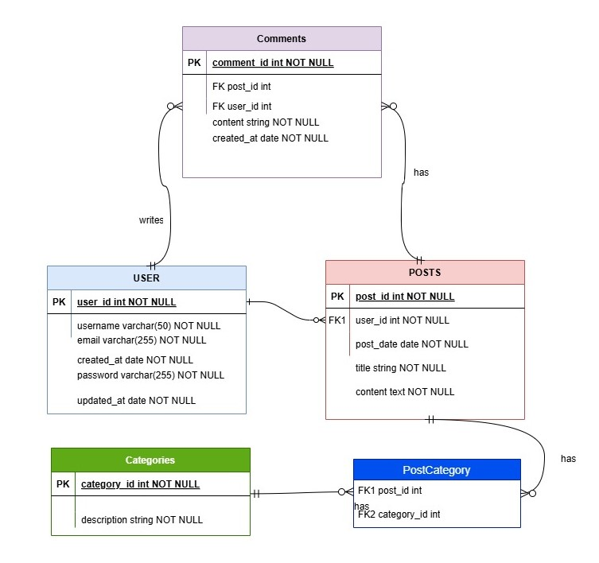

# Blogging System with Sequelize

A simple and scalable blogging platform built using Node.js, Express, Sequelize, and MySQL. This project enables users to create, update, delete, and view blog posts. It also supports user authentication and categorization of posts.

## Technologies Used

- **Node.js**: JavaScript runtime for building the server-side application.
- **Express**: A minimal and flexible Node.js web application framework.
- **Sequelize**: Promise-based ORM for Node.js for interacting with MySQL database.
- **MySQL**: Relational database for storing user and post data.
- **Jest**: Testing framework for running unit and integration tests.
- **Docker**: Containerization for easy development and deployment.

## Database ERD


## Example Routes

Below are some example routes that demonstrate how to interact with the blogging system.

### 1. Create a Post
- **Endpoint**: `POST /posts/createPost`

**Request Body**:
```json
{
  "title": "My First Post",
  "content": "This is the content of my first post.",
  "userId": 1
}
```

**Response**:
```json
{
  "id": 1,
  "title": "My First Post",
  "content": "This is the content of my first post.",
  "userId": 1,
  "createdAt": "2024-11-08T10:00:00.000Z",
  "updatedAt": "2024-11-08T10:00:00.000Z"
}
```

### 2. Get All Posts
- **Endpoint**: `GET /posts/getAllPosts`

**Response**:
```json
[
    {
        "id": 5,
        "title": "SQL",
        "content": "SQL is amazing",
        "userId": 3,
        "createdAt": "2024-11-08T09:14:38.000Z",
        "updatedAt": "2024-11-08T09:14:38.000Z",
        "user": {
            "id": 3,
            "username": "Faris",
            "email": "faris@gmail.com",
            "password": "$2b$10$KJ6qxcyNCmNv8RdJo5lXGuFptcmqb/zD0A5XkfIyhuoeHYIXTHkXK",
            "createdAt": "2024-11-08T09:11:54.000Z",
            "updatedAt": "2024-11-08T09:11:54.000Z"
        },
        "categories": [
            {
                "id": 3,
                "description": "testcategory",
                "createdAt": "2024-11-08T09:19:58.000Z",
                "updatedAt": "2024-11-08T09:19:58.000Z",
                "posts_categories": {
                    "postId": 5,
                    "categoryId": 3,
                    "createdAt": "2024-11-08T09:19:58.000Z",
                    "updatedAt": "2024-11-08T09:19:58.000Z"
                }
            }
        ],
        "comments": [
            {
                "id": 1,
                "content": "testcontent",
                "postId": 5,
                "userId": 3,
                "createdAt": "2024-11-08T09:17:31.000Z",
                "updatedAt": "2024-11-08T09:17:31.000Z"
            }
        ]
    },
    {
        // Additional post objects...
    }
]
```

### 3. Get a Post by ID
- **Endpoint**: `GET /posts/getPostById/:id`

**Response**:
```json
{
    // Post object similar to the one shown in Get All Posts
}
```

### 4. Update a Post
- **Endpoint**: `PUT /posts/:id`

**Request Body**:
```json
{
  "title": "Updated Post Title",
  "content": "This is the updated content of the post."
}
```

**Response**:
```json
{
    // Updated post object...
}
```

### 5. Delete a Post
- **Endpoint**: `DELETE /posts/:id`

**Response**:
```json
{
    "message": "Post deleted successfully"
}
```

## Getting Started

To run this project locally, you need to have Docker and Node.js installed. Here are the steps to get started:

1. **Clone the repository**
   ```bash
   git clone https://github.com/yourusername/blogging-system-sequelize.git
   cd blogging-system-sequelize
   ```

2. **Install dependencies**
   ```bash
   npm install
   ```

3. **Set up the database**
   If you're using Docker, you can use `docker-compose` to set up the MySQL container. Make sure you have a `docker-compose.yml` file that defines the MySQL service, or use the following example:

   ```yaml
   version: '3'
   services:
     db:
       image: mysql:latest
       environment:
         MYSQL_ROOT_PASSWORD: rootpassword
         MYSQL_USER: user
         MYSQL_PASSWORD: password
         MYSQL_DATABASE: blogging_db
       ports:
         - '3306:3306'
   ```

   Run the database container:
   ```bash
   docker-compose up -d
   ```

4. **Run the application**
   To start the application:
   ```bash
   npm start
   ```

Your app will be running on [http://localhost:3000](http://localhost:3000).
